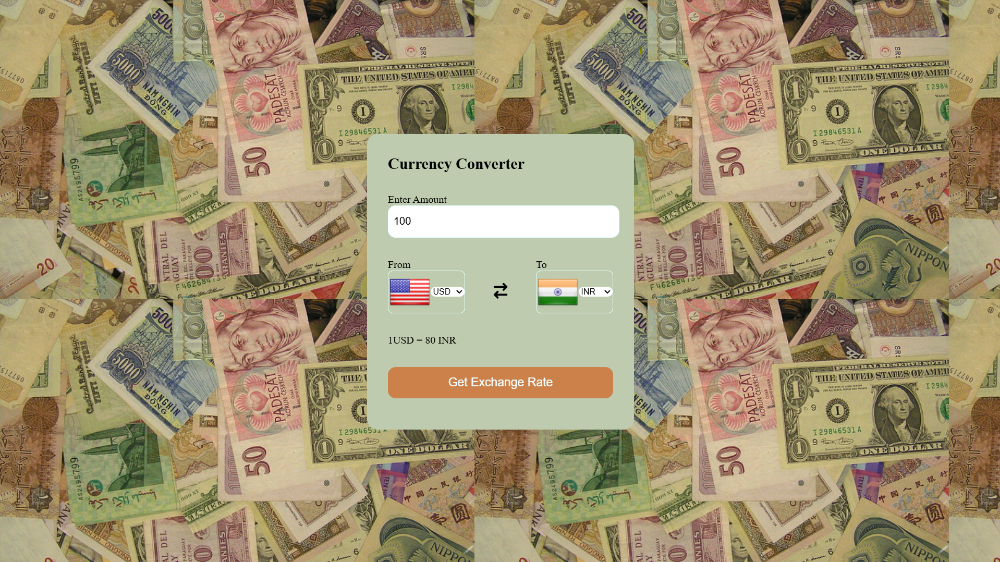

# Currency-Converter

This is a currency converter web application that allows users to convert between different currencies. The app is built using HTML, CSS, and JavaScript and utilizes a public API to fetch the latest exchange rates.

## Features

- **Currency Conversion**: Convert an amount from one currency to another.
- **Real-time Exchange Rates**: Fetches up-to-date exchange rates from a reliable API.
- **Interactive UI**: Dropdowns to select currencies, input for amount, and a button to get the conversion rate.

## Technologies Used

- **HTML**: For the structure of the web page.
- **CSS**: For styling the web page, including layout, colors, and fonts.
- **JavaScript**: For fetching data from the API and updating the DOM based on user interactions.
- **API**: Uses the [Currency API](https://github.com/fawazahmed0/currency-api) to get the latest exchange rates.

## Setup

1. **Clone the repository:**

   ```bash
   git clone https://github.com/your-username/currency-converter.git
   cd currency-converter
2. **Open the index.html file in your browser.**

## How It Works
- Dropdowns for Currency Selection: The app includes two dropdowns where users can select the currencies they want to convert from and to.

- Input for Amount: Users can input the amount they wish to convert in the text field.

- Fetching Exchange Rates: When the user clicks the "Get Exchange Rate" button, the app fetches the latest exchange rate between the selected currencies using the Currency API.

- Displaying Results: The converted amount is displayed below the form, along with the exchange rate.
  
## Screenshot

